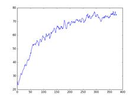

# Reinforcement Learning on Mario Kart

This project implements an environment for RL algorithms on Mario Kart using the [Mupen64Plus emulator](https://github.com/mupen64plus) and includes a simple implementation of the [PAAC](https://github.com/Alfredvc/paac) algorithm .


A lot of code was taken directly from the [M64Py](https://github.com/mupen64plus/mupen64plus-ui-python) project.

## Getting Started

### Prerequisites

Requirements:
* Python 3.4+ (32bit version in Windows, 64bit version on Linux)
* TensorFlow 1.0+
* mupen64plus
* SDL1.2 or SDL2

example on Ubuntu:
```
sudo apt-get install mupen64plus libsdl2-dev
```

### Installing

* plugin_paths.py needs to be adjusted according the the respective system (the easiest way to find the correct paths is using [m64py](http://m64py.sourceforge.net/))
* check if the path to the savefile in 'mariokart.py' is 'save'state.st0' if you are running it on Linux or 'luigi_raceway_mario.state' if you are running it on Windows
* The mupen64plus.config (in Linux: /home/usr/.config/mupen64plus) needs to be adjusted and set to:

```
ScreenWidth = 200
ScreenHeight = 150
```
* Rename the file sdl12_defs.py or sdl2_defs.py to defs.py (depending on your version of sdl)
* adjust NUM_LEARNERS in run.py according to the power of your system (default=12)

## Usage
### Training the net

To train the net run (repeadetly):
'''
python -i run.py
train_episode()
'''

Note that the training will always be made with the same savestate and thus on the same track!
### Create a video/ generate frames
To create a test video without actually learning simply run:
'''
python -i run.py
train()
'''
### Using stored weights
To use the provided weights simply decomment the line 
'''
saver.restore(session, "checkpoints/380-it.ckpt")
'''
Note that if you want to restore the weights instead using the terminal you have to initialize the variables first
'''
session.run(tf.global_variables_initializer())
'''
## Short theoratical Background

## Discussion and possible improvements of the current state
* The provided weights were only trained with the current frame instead of the whole history of frames as in the original DQN paper, hence the velocity was probably hard/ impossible to learn (the implementation to use the average of 4 frames is already implemented but decommented)
* The reward is currently only the distance to the previous step and thus really small, it could easily be scaled to be in the normal range [-1,1] but the current loss function wouldn't profit from it. However the racetrack progress (gained by reading out the RAM) is not very smooth and it's hard to distinguish between acceleration and no-operation.
* The network structure is a reimplemenation of the Nature network used in [PAAC](https://github.com/Alfredvc/paac) and thus fine tuned for Atari games and the performance could probably be improved through fine tuning. It might also make sense to use a more sophisticated CNN structure due to the more complicated environment of a 3D N64 environment in comparison to the relative simple 2D environment of Atari games.
* The provided weights were trained for 4 days with 12 parallel agents (in comparison to 32 agent in the default settings of the default PAAC implementation) with a relative old CPU (Phenom II X4 965) without support of Cudacores for tensorflow
* The total reward per trainings iteration did increase relatively linear and was still rising when the training was stopped, the graph was taken at 380 trainingsiteration of 100 steps:

* The training currently always begins at the same time and stops for all agents after a certain stepsize, thus the situations are always relatively similar. The training might be more useful using several different savestates or somethign similar.

## Known Bug and Workaround
Sometimes the emulator fails to start in the right size 200x150 and instead starts in 640x480, which leads to a crash.
Simply set the 'mupen64plus.config' to the right screenwidht and screensize again and restart the emulator, alternatively you can use the provided backup.


